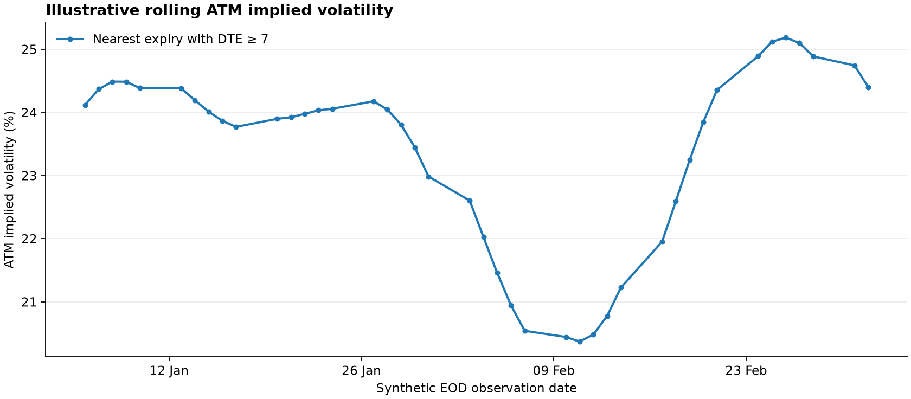
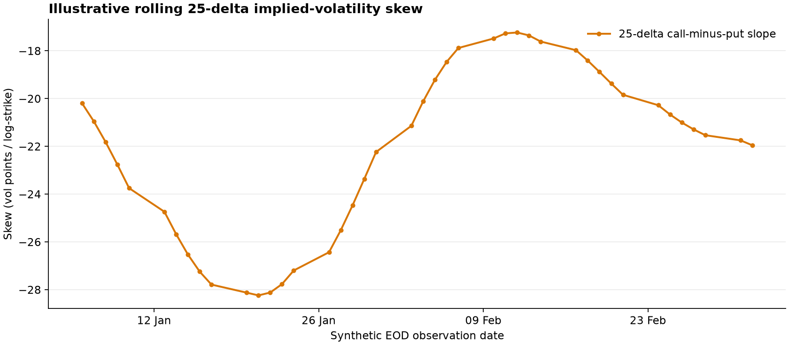

# OptionChainAnalytics

[](https://pypi.org/project/option-chain-analytics/)
[](https://pypi.org/project/option-chain-analytics/)
[](LICENSE)
[](https://github.com/ArturSepp/OptionChainAnalytics/actions/workflows/ci.yml)
[](https://pepy.tech/project/option-chain-analytics)

OptionChainAnalytics provides point-in-time option-chain containers, feed normalisation,
chain reconstruction, queries, and visualisation in Python for quantitative research.

It is the data-container layer: provider credentials and data rights, pricing models, portfolio
backtests, and proprietary datasets remain separate. Pricing and implied-volatility inversion are delegated to
[`vanilla-option-pricers`](https://github.com/ArturSepp/VanillaOptionPricers); generic time-series
and plotting utilities come from [`qis`](https://github.com/ArturSepp/QuantInvestStrats).

## Install

OptionChainAnalytics requires Python 3.10 or newer. CI covers Python 3.10 through 3.14.

Install the published package:

```bash
pip install option-chain-analytics
```

For development from a clone:

```bash
pip install -e .
```

Provider-specific integrations are optional:

| Extra | Capability |
|---|---|
| `cboe` | Local Arrow/Feather CBOE fitted-chain files |
| `deribit` | Deribit HTTP collection helpers |
| `bloomberg` | Bloomberg retrieval through `bbg-fetch` |
| `thetadata` | ThetaData national EOD equity/ETF option reports (Python 3.12+) |
| `docs`, `dev`, `all` | Documentation, contributor tooling, or every optional integration |

For example, `pip install "option-chain-analytics[cboe]"` installs the CBOE file dependency without
installing unrelated network providers.

## First success: no data or credentials

The authoritative offline example constructs a deterministic Black-Scholes-Merton option panel,
reconstructs a historical chain, queries its front-expiry ATM strike and volatility, and selects a
weekly roll maturity:

```bash
python examples/first_success.py
```

Expected evidence:

```text
ticker=SYNTH
observation_times=2
contracts_at_first_time=30
expiries=['12Jan2024', '19Jan2024', '16Feb2024']
first_expiry_atm=100.00, vol=0.2057
weekly_roll_expiries=['12Jan2024']
```

See [`examples/first_success.py`](examples/first_success.py) for the executable source. The
documentation includes that file directly, so the tutorial cannot drift into a second
implementation.

## Supported examples

OCA keeps six repository examples with explicit data boundaries:

- deterministic offline construction and one-expiry ThetaData-shaped analytics;
- resumable ThetaData EOD cache construction, cache-first ATM/skew plots, and PDF chain reports;
- standardized local SPX, VIX, BTC, and ETH cache construction.

The [examples guide](examples/README.md) lists every script, its required data, whether it makes a
network request, and its output. Removed research prototypes are not retained as runnable examples.

## Data model

- `OptionsDataDFs` holds an option-observation panel (`chain_ts`) plus an aligned spot-price frame.
- `SlicesChain` reconstructs all available expiries at one exact observation time.
- `ExpirySlice` provides call/put, ATM, delta-strike, volatility, open-interest, and execution-price
  queries for one expiry.
- `SliceColumn` defines the common option-feed schema, including source time, contract, forward,
  discount factor, strike, expiry, quote, implied volatility, Greeks, volume, and open interest.

Observation and expiry timestamps are timezone-aware. Exact lookup is the reconstruction default;
scheduled studies can explicitly select the latest previous observation, but never a later one.
Volatilities are decimals (`0.20` means 20%), time to maturity is in years, and each adapter must
preserve and document its price/multiplier convention.

Provider adapters own feed-specific choices such as report alignment, rate symbols, settlement
timestamps, product scope, and admissible bounds. Reusable numerical kernels live separately under
`option_chain_analytics.utils`; the call-put parity utility has no provider or optional-solver
dependency. Black-Scholes analytics remain delegated to `vanilla-option-pricers`.

## Empirical feeds

Local adapters cover Deribit/Tardis crypto histories and SPX/VIX CBOE fitted-chain files. These
datasets are not distributed. `OCA_DATA_PATH` holds raw provider archives, `OCA_CACHE_PATH` holds
normalized reusable chains, and `OCA_OUTPUT_PATH` holds generated reports. Their source-checkout
defaults are the ignored `data/`, `resources/`, and `outputs/` directories. The
[data catalogue](docs/data_sources.md#canonical-data-catalogue-and-storage) defines every supported
provider directory, cache filename, and loader. CBOE files can be mapped with:

```python
from option_chain_analytics import OptionsDataDFs
from option_chain_analytics.data.cboe import load_local_cboe_options_data

options_data = OptionsDataDFs(
    **load_local_cboe_options_data(
        ticker='SPX',
        start='2023-01-03',
        end='2023-01-03',
    )
)
```

The CBOE mapper always infers bid/ask implied volatilities from the source bid/ask prices using
the contemporaneous forward, discount factor, and time to maturity. This keeps every CBOE-backed
`OptionsDataDFs` instance on the same complete schema.

For repeated empirical studies, build one normalized Parquet cache per underlying after installing
the `cboe` extra:

```python
from option_chain_analytics.data.cboe import build_local_cboe_options_cache

build_local_cboe_options_cache(ticker='SPX')
build_local_cboe_options_cache(ticker='VIX')
```

This creates ignored `resources/cboe_options/spx_options_oca.parquet` and
`resources/cboe_options/vix_options_oca.parquet` files by default. The normal loader uses a valid
cache automatically and still accepts `start`/`end` filters. OCA embeds its cache schema and
source-file fingerprint in each Parquet file and rejects stale caches. Use `overwrite=True` to
rebuild deliberately.

CBOE data supplies implied forwards but no independent spot series. Pass `spot_data`, or use
`is_use_front_forward_as_spot=True` only for visualisation; a forward proxy is not a valid spot
return series for backtesting.

### ThetaData EOD workflow

ThetaData national EOD reports provide historical US equity and ETF option quotes. OCA converts
them to the same `OptionsDataDFs` schema used by the local CBOE and Tardis adapters. Index options
with product-specific or AM settlement conventions are deliberately outside this adapter.

#### 1. Install and authenticate

Install the optional official client integration:

```bash
pip install "option-chain-analytics[thetadata]"
```

The official client reads `THETADATA_API_KEY` or its supported credentials file. For example, a
PowerShell session can keep the key in process memory without writing it into the repository:

```powershell
$thetaKey = Read-Host "ThetaData API key" -AsSecureString
$env:THETADATA_API_KEY = [System.Net.NetworkCredential]::new('', $thetaKey).Password
```

Credentials and raw provider responses are never written to OCA's normalized cache.

#### 2. Build or resume a local history

The supported builder requests one month at a time and checkpoints each completed partition. An
interrupted request can therefore be rerun safely; compatible existing months are skipped. The
default end date is yesterday, which is suitable for delayed-data accounts:

```bash
python examples/build_thetadata_eod_cache.py \
    --ticker NVDA \
    --start-date 2023-06-01
```

By default this stores normalized files under
`resources/thetadata_options/nvda/{options,spot}/YYYY-MM.parquet`. Set `OCA_CACHE_PATH` or pass
`--output-dir` to choose another private cache root. The default request keeps expiries from 0 to
60 calendar DTE and 20 strikes around spot; pass `--all-strikes` only when the larger download is
actually required.

The same workflow is available through the package API:

```python
from option_chain_analytics import build_thetadata_eod_cache, load_thetadata_eod_cache

cache_root = build_thetadata_eod_cache(
    ticker='NVDA',
    start_date='2023-06-01',
    min_dte=0,
    max_dte=60,
    strike_range=20,
)
options_data = load_thetadata_eod_cache(cache_root)

print(options_data.ticker)
print(len(options_data.chain_ts), 'option observations')
print(len(options_data.get_timeindex()), 'EOD chains')
```

Monthly Parquet files are only the resumable physical layout: the loader returns one continuous
`OptionsDataDFs`. Date bounds avoid scanning the full cache when an analysis needs a shorter window:

```python
nvda_july = load_thetadata_eod_cache(
    cache_root,
    start_date='2026-07-01',
    end_date='2026-07-31',
)
```

#### 3. Reconstruct a chain and extract volatility

Every provider report retains its actual timestamp. Select one of those timestamps and reconstruct
the chain exactly—there is no implicit borrowing from a later observation:

```python
import pandas as pd

from option_chain_analytics import create_chain_at_time

value_time = nvda_july.get_timeindex()[-1]
chain = create_chain_at_time(nvda_july, value_time)

# Select the first listed expiry at least seven calendar days away.
slice_id = chain.get_next_slice_after_date(value_time + pd.Timedelta(days=7))
atm_vol = chain.get_atm_vol(slice_id=slice_id)
skew_25d = chain.get_skew(slice_id=slice_id, delta=0.25)

print({'value_time': value_time, 'expiry': slice_id, 'atm_vol': atm_vol, 'skew_25d': skew_25d})
```

Volatility values are decimals: `0.25` means 25%. ATM volatility averages the available call and
put mark IVs at the nearest forward strike. OCA's delta skew is
`(call IV - put IV) / log(call strike / put strike)` at the requested absolute delta.

#### 4. Extract and plot rolling ATM volatility and skew

The following installed-package example reconstructs every exact EOD chain and rolls to the first
expiry at least seven calendar days away. Because it uses only the public OCA API, it works after a
normal `pip install`; the repository `examples/` directory is not required:

```python
import matplotlib.pyplot as plt
import pandas as pd

from option_chain_analytics import create_chain_timeseries

# Reconstruct exactly the reports present in the bounded cache. Using the
# observed timestamps avoids introducing a synthetic schedule or look-ahead.
observation_times = nvda_july.get_timeindex()
chains = create_chain_timeseries(
    options_data=nvda_july,
    dates_schedule=observation_times,
    time_selection='exact',
)

records = []
for value_time, chain in chains.items():
    roll_boundary = value_time + pd.Timedelta(days=7)
    eligible = [
        (expiry_slice.expiry_time, slice_id)
        for slice_id, expiry_slice in chain.expiry_slices.items()
        if expiry_slice.expiry_time >= roll_boundary
    ]
    if not eligible:
        continue

    expiry_time, slice_id = min(eligible)
    atm_vol = chain.get_atm_vol(slice_id=slice_id)
    skew_25d = chain.get_skew(slice_id=slice_id, delta=0.25)
    if atm_vol is None or not pd.notna(atm_vol):
        continue
    records.append(
        {
            'value_time': value_time,
            'expiration': expiry_time,
            'dte': (expiry_time - value_time).total_seconds() / 86_400.0,
            'atm_vol': float(atm_vol),
            'skew_25d': None if skew_25d is None or not pd.notna(skew_25d) else float(skew_25d),
        }
    )

vol_data = pd.DataFrame(records).set_index('value_time').sort_index()
if vol_data.empty:
    raise RuntimeError('the selected cache window has no eligible rolling expiries')

# Volatilities are stored as decimals, so multiply by 100 for percentage axes.
atm_figure, atm_axis = plt.subplots(figsize=(11, 5), tight_layout=True)
atm_axis.plot(vol_data.index, 100.0 * vol_data['atm_vol'], marker='o')
atm_axis.set_ylabel('ATM implied volatility (%)')
atm_axis.set_xlabel('ThetaData EOD observation time')
atm_axis.set_title('NVDA rolling ATM implied volatility')
atm_axis.grid(alpha=0.3)
atm_figure.autofmt_xdate()
atm_figure.savefig('nvda_atm_vol.png', dpi=160)

skew_figure, skew_axis = plt.subplots(figsize=(11, 5), tight_layout=True)
skew_axis.plot(vol_data.index, 100.0 * vol_data['skew_25d'], marker='o', color='tab:orange')
skew_axis.axhline(0.0, color='black', linewidth=0.8)
skew_axis.set_ylabel('25-delta skew (vol points / log-strike)')
skew_axis.set_xlabel('ThetaData EOD observation time')
skew_axis.set_title('NVDA rolling 25-delta implied-volatility skew')
skew_axis.grid(alpha=0.3)
skew_figure.autofmt_xdate()
skew_figure.savefig('nvda_25d_skew.png', dpi=160)
```

`vol_data` is the empirical table used by the plot. It retains the selected expiration and actual
calendar DTE beside each ATM-volatility and skew observation, so maturity rolling is inspectable.

The figures below are generated internally from OCA's deterministic simulated data, using the same
schema, chain reconstruction, and seven-calendar-day roll as the ThetaData example. They illustrate
the expected outputs without redistributing licensed market observations:





Regenerate both documentation assets offline with
`python tools/generate_readme_figures.py`.

The repository also provides cache-first command-line wrappers for separate ATM and skew figures:

```bash
python examples/fetch_thetadata_atm_timeseries.py \
    --ticker NVDA --start-date 2026-07-01 --end-date 2026-07-31 \
    --metric atm --output nvda_atm_vol.png
python examples/fetch_thetadata_atm_timeseries.py \
    --ticker NVDA --start-date 2026-07-01 --end-date 2026-07-31 \
    --metric skew --delta 0.25 --output nvda_25d_skew.png
```

#### 5. Plot the complete option chain at one exact date

Load only the required report date, reconstruct its actual provider timestamp, and create the
strike-space and delta-space figures for every live expiry. The figures can be inspected in memory
or persisted as one multi-page PDF:

```python
from matplotlib.backends.backend_pdf import PdfPages

from option_chain_analytics import (
    create_chain_at_time,
    load_thetadata_eod_cache,
    run_chain_report,
)

report_date = '2026-07-17'
one_day = load_thetadata_eod_cache(
    cache_root,
    start_date=report_date,
    end_date=report_date,
)
if len(one_day.get_timeindex()) == 0:
    raise RuntimeError(f'no ThetaData report is cached for {report_date}')

# The date identifies a cache partition; value_time is the actual provider
# report timestamp retained by OCA.
value_time = one_day.get_timeindex()[0]
chain = create_chain_at_time(
    options_data=one_day,
    value_time=value_time,
    time_selection='exact',
)
if chain is None:
    raise RuntimeError(f'no exact option chain is available at {value_time}')

print('value_time:', chain.value_time)
print('expiries:', list(chain.expiry_slices))
print('contracts:', len(chain.options_df))

figures = run_chain_report(chain)
with PdfPages('nvda_chain_20260717.pdf') as pdf:
    for figure in figures.values():
        pdf.savefig(figure)
```

The equivalent repository command is:

```bash
python examples/run_chain_report.py \
    --ticker NVDA --date 2026-07-17 --output nvda_chain_report.pdf
```

#### Snapshot and direct-live alternatives

`fetch_thetadata_eod.py` is a small single-expiry example. Without `--live` it is synthetic,
deterministic, credential-free, and does not contact ThetaData:

```bash
python examples/fetch_thetadata_eod.py
python examples/fetch_thetadata_eod.py --live --ticker AAPL \
    --value-date 2026-07-24 --expiration 2026-08-21 --metric both
```

For a short range that should not be cached, pass `--live` to
`fetch_thetadata_atm_timeseries.py`, or call `fetch_and_plot_thetadata_atm_vols` and
`fetch_and_plot_thetadata_skew` from that module. Cache-first access is recommended for repeated
research because it avoids downloading the same reports again.

The adapter records the provider's actual EOD report time, joins only an underlying report
available at or before that time, and preserves both calls and puts. Direct snapshot/time-series
loads retrieve ThetaData SOFR EOD by default to anchor the discount factor and then robustly infer
forwards from parity; pass `rate_symbol=None` for a parity-only fit. The partitioned cache builder
uses the parity-only policy. Every bid, mark, and ask IV and every mark Greek is computed by
`vanilla-option-pricers`, rather than mixing provider and OCA analytics.

## Documentation and development

Start with the [documentation site](https://artursepp.github.io/OptionChainAnalytics/), then read the
[schema contract](https://artursepp.github.io/OptionChainAnalytics/schema.html),
[point-in-time reconstruction](https://artursepp.github.io/OptionChainAnalytics/point_in_time.html),
and [data-source guide](https://artursepp.github.io/OptionChainAnalytics/data_sources.html).

```bash
pytest -q
ruff check src tests examples tools docs/conf.py
sphinx-build -W -b html docs docs/_build/html
python -m build
```

The installable package lives under `src/option_chain_analytics/`; repository-only scripts live in
`examples/`. Automated checks use `tests/test_*.py`. Component development diagnostics live beside
their implementation in `src/option_chain_analytics/**/run_local/*_run.py`, expose `Locals` and
`run_local(local=...)`, and are excluded from distributions. The `run_local` folders use Python's
implicit namespace-package support and therefore contain no `__init__.py` files. Raw datasets,
normalized caches, agent reports, and generated outputs live in ignored `data/`, `resources/`,
`agents/`, and `outputs/` directories.

## Research and licensing boundary

OCA can provide a public, auditable input layer for empirical studies and replication. Strategy
logic and the QF-paper backtests remain in SigmaStrats, and a public example is not expected to
reproduce results computed from a private production dataset exactly.

The software is released under the [MIT License](LICENSE). Dataset licences and access terms are
separate from the software licence. Citation metadata is provided in [`CITATION.cff`](CITATION.cff),
and contribution guidance is provided in [`CONTRIBUTING.md`](CONTRIBUTING.md).
